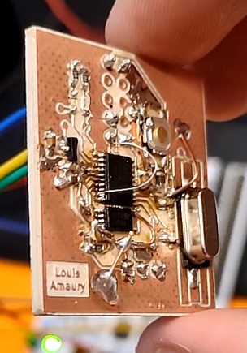

# Tests réalisés sur la carte

## Tests éléctronique
Nous avons testé au multimètre si les différents ground et 3,3V étaient reliés entre eux. Nous avons réalisés le même tests sur les différents pins du circuit.
Pour vérifier la qualité de notre soudure, nous avons vérifié qu'il n'y ai aucun court circuit et les valeurs des différents composants (résistances et capacités).
En regardant au microscope et en testant, on a remarqué quelques courts-circuits que nous avons immédiatement resoudé.

Nous avons cependant fait un grave erreur dès le schematic de notre carte : nous avons connecté les ports SWCLK et SWDIO sur les mauvais ports, ce qui empêchait le bon fonctionnement de la carte... Nous avons dû improvisé en créant des pistes volantes pour bien les connecter.

La photo ci-dessous montre le routage de SWCLK et SWDIO sur les pins 19 et 20 du stm32f030f4. Ils ne sont là que pour garder en tête les correction à faire dans le cas d'un second prototypage.

  

## Tests informatiques

A l'aide de la documentation fournis sur le site : https://linuxembedded.fr/2021/02/bare-metal-from-zero-to-blink, nous avons réaliser un Startup file nommé stm32_startup.c permettant de bien définir l'environnement pour le code main().
Il permet entre autre de gérer les handler du stm32f030f4 et d'attribuer les bonnes fonctions aux handler.

Nous avons ensuite créer le Linker cript nommé stm32_ls.ld qui permet de déterminer les adresses absolues des différentes sections en faisant référence aux informations mentionnées dans le Linker script.

Nous avons ensuite effectuer les modification necessaire pour permettre l'utilisation d'OpenOCD avec la carte : https://www.radioshuttle.de/en/turtle-en/nucleo-st-link-interface-en/

## Résultats et axes d'améliorations

Photos de la cartes finale soudées.

  

Photos de l'écran lors du lancement de la commande make load.

  

On observe bien la bonne détection de la carte.

Vidéo de la carte lors du test avec OpenOCD.

  

Nous avons trouver ce projet fort enrichissant mais il manque à notre sens, cruellement de temps pour pouvoir effectuer le code et tous les tests unitaires nécessaire au test complet de la carte. Cependant le projet fût très enrichissant et à permis de mettre en pratique les connaissances vues en cours de TMS.

Le pipeline du Gitlab-CI se résume à un cpp-check suivi d'une étape de build et d'une étape de lint.

